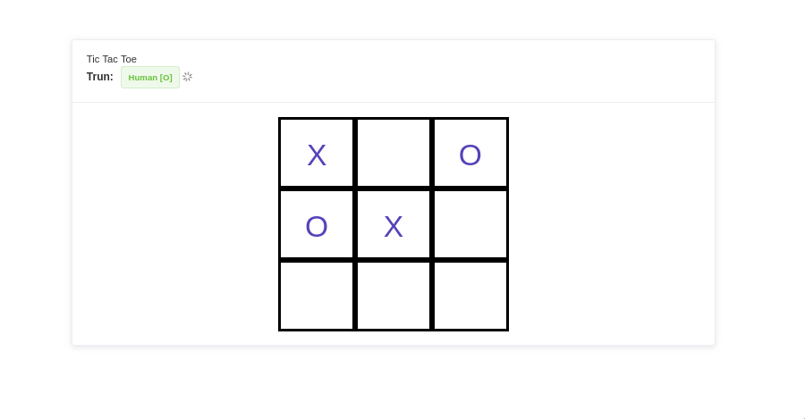

# Tic Tac Toe

this is a game let people paly with computer and will never win this game.


## Technology framework
* golang
* gobufflo (web framework)
* Vuejs
	* all gaming logic are written by javascript.
	* You can find the code place on `./app/vue/tic-graph/tic-graph.vue`


## How to start it.
I had prepared pre-built binary for mac & linux Edition (x86 64bit).

```
cd build/linux/
./tic_tac_toe
```
Otherwise you can follow [installation.md](./installation.md) to build this web application your self.
